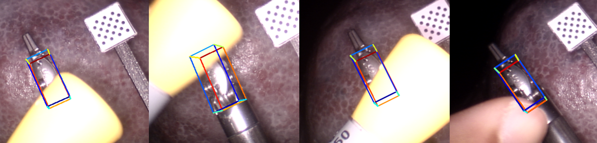
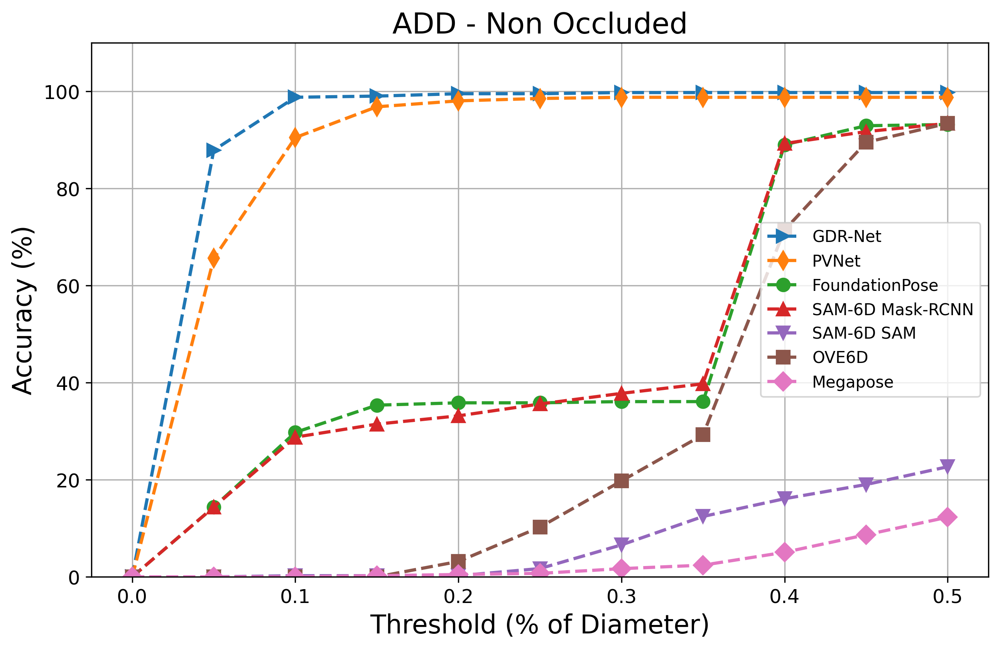
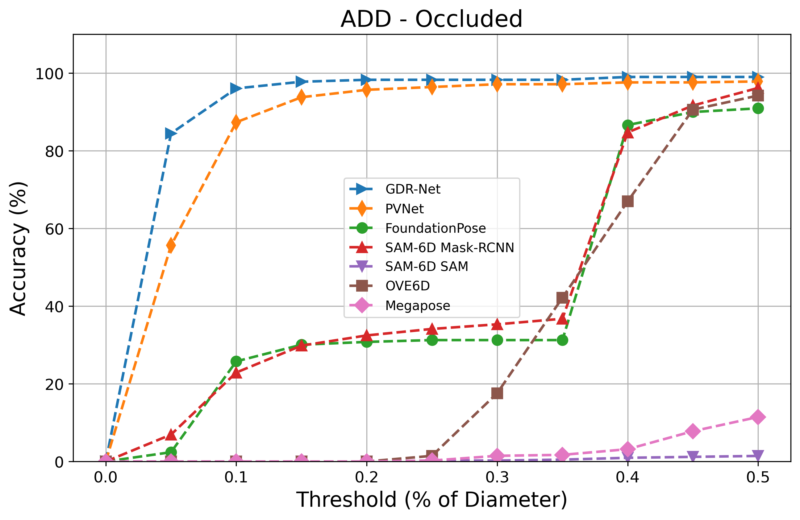
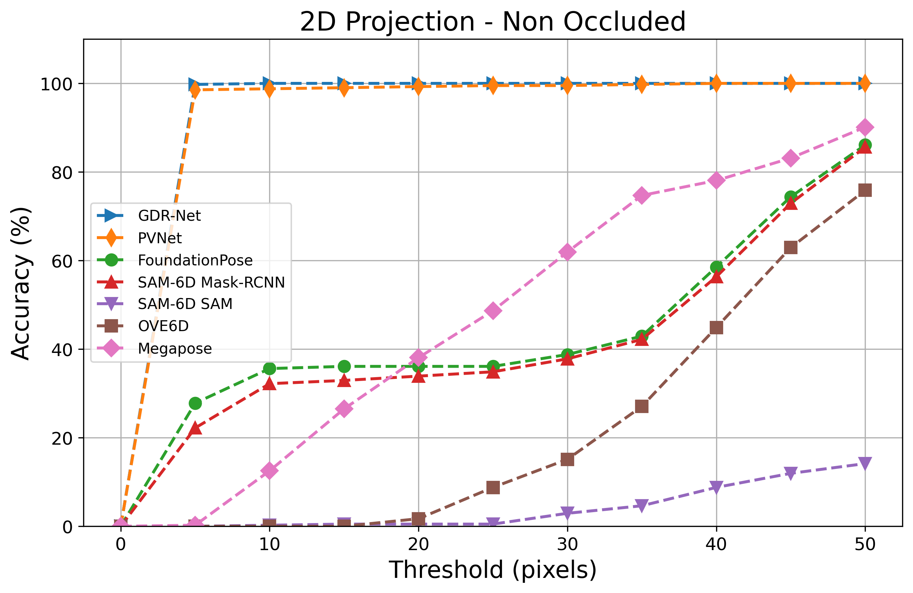
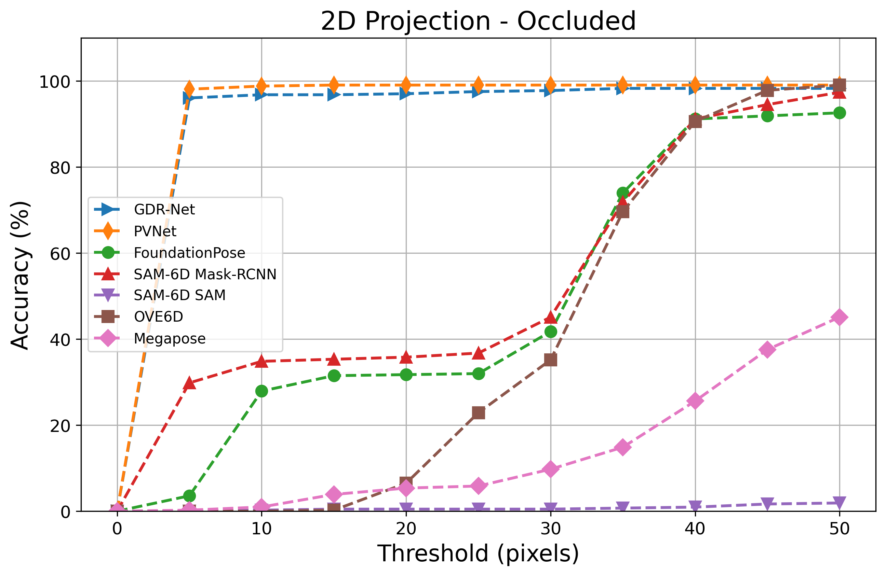

# VISION-BASED POSE ESTIMATION OF SURGICAL INSTRUMENTS IN ROBOTIC SURGERY

This repository implements and evaluates various state-of-the-art methods for **monocular depth estimation**, **stereo camera depth estimation**, and **pose estimation** of surgical instruments in robotic surgery, specifically for **Remote Minimal Invasive Surgical (RMIS)** applications. The methods tested include **FoundationPose**, **SAM-6D**, **OVE6D**, **Megapose**, **PVNet**, **GDR-Net**, and others. The project was part of an MSc in **Computing (Artificial Intelligence and Machine Learning)** at **Imperial College London**.

The repositories referenced and used here have been **adapted and extended** to meet the unique challenges of surgical instrument pose estimation in RMIS applications, such as high precision, non-rigid tools, and limited workspace environments.

**Objective**

This project explores pose estimation methodologies tailored for Robotic-assisted Minimally Invasive Surgery (RMIS). A novel stereo-based pose estimation pipeline is developed, eliminating the need for depth sensors by leveraging stereo images and the RAFT-Stereo model, improving upon traditional methods like Semi-Global Matching (SGM).

Both zero-shot models (FoundationPose, SAM-6D, OVE6D, and Megapose) and supervised learning models (PVNet and GDR-Net) were evaluated. GDR-Net, combined with Mask R-CNN, excelled in occluded scenarios, while PVNet showed variability in 3D pose estimation. The project introduces an end-to-end pipeline for handling seen and novel objects, relying solely on stereo images, making it adaptable to various surgical settings.

Dataset generation tools were developed, adhering to the BOP standard, supporting future research. Enhancements to the SAM-6D model, including integrating Mask R-CNN, led to improved accuracy and reduced runtime, with a 35% performance gain. PVNet emerged as the most efficient model for real-time applications whereas GDR-Net the most accurate.

---

## Results

  
  

  
  

## Project Structure

This repository is organized into several subdirectories, each containing code and instructions for specific methods
For detailed instructions on setting up and running these scripts, see the [Data prepartion README](Data_Generation_Preparation/README.MD).

### 1. Dataset Preparation and Generation

Include tools for creating custom dataset in BOP Format

### 1. **Unseen Method Pipeline**

Includes implementations for unseen object pose estimation using:
- **FoundationPose**
- **SAM-6D**
- **OVE6D**
- **Megapose**

For detailed instructions on setting up and running these models, see the [Unseen Method Pipeline README](Unseen_Pipeline/README.MD).

### 2. **Seen Method Pipeline**

Contains methods for seen object pose estimation using:
- **PVNet**
- **GDR-Net**

Instructions for dataset preparation, training, testing, and visualization can be found in the [Seen Method Pipeline README](Seen_Pipeline/README.MD).

### 3. **Monocular Metric Depth Estimation**

Implements the following methods for monocular depth estimation:
- **Depth Anything**
- **UniDepth**
- **Metric3D**

See the [Monocular Metric Depth Estimation README](Monocular_metric_depth_estimation/README.MD) for setup and inference details.

---

## Installation Instructions

Each subdirectory contains its own `environment.yml` or `requirements.txt` for setting up the required dependencies. For most methods, **CUDA** compatibility is necessary, so please refer to the specific method README and official repositories for further details.

---

## External Repositories

The following repositories were adapted and extended to suit RMIS applications. Below are the links to the official repositories, along with the associated publications.

### Pose Estimation Models

1. **FoundationPose**  
   GitHub Repository: [https://github.com/NVlabs/FoundationPose](https://github.com/NVlabs/FoundationPose)  

2. **SAM-6D**  
   GitHub Repository: [https://github.com/JiehongLin/SAM-6D](https://github.com/JiehongLin/SAM-6D)  

3. **OVE6D**  
   GitHub Repository: [https://github.com/dingdingcai/OVE6D-pose](https://github.com/dingdingcai/OVE6D-pose)  

4. **Megapose**  
   GitHub Repository: [https://github.com/megapose6d/megapose6d](https://github.com/megapose6d/megapose6d)  

5. **PVNet**  
   GitHub Repository: [https://github.com/zju3dv/clean-pvnet](https://github.com/zju3dv/clean-pvnet)  

6. **GDR-Net**  
   GitHub Repository: [https://github.com/shanice-l/gdrnpp_bop2022](https://github.com/shanice-l/gdrnpp_bop2022)  

### Depth Estimation Models

1. **RAFT-Stereo**  
   GitHub Repository: [https://github.com/princeton-vl/RAFT-Stereo](https://github.com/princeton-vl/RAFT-Stereo)  

2. **Depth Anything**  
   GitHub Repository: [https://github.com/LiheYoung/Depth-Anything](https://github.com/LiheYoung/Depth-Anything)  
3. **UniDepth**  
   GitHub Repository: [https://github.com/lpiccinelli-eth/UniDepth](https://github.com/lpiccinelli-eth/UniDepth)  

4. **Metric3D**  
   GitHub Repository: [https://github.com/YvanYin/Metric3D](https://github.com/YvanYin/Metric3D)  

### Synthetic Dataset Generation and Rendering Tools

1. **Deep Object Pose Estimation (DOPE)**  
   GitHub Repository: [https://github.com/NVlabs/Deep_Object_Pose](https://github.com/NVlabs/Deep_Object_Pose)  

2. **NVISII**  
   GitHub Repository: [https://github.com/owl-project/NVISII](https://github.com/owl-project/NVISII)  

3. **BOP Toolkit**  
   GitHub Repository: [https://github.com/thodan/bop_toolkit](https://github.com/thodan/bop_toolkit)  

4. **BOP Renderer**  
   GitHub Repository: [https://github.com/thodan/bop_renderer](https://github.com/thodan/bop_renderer)  

5. **BlenderProc**  
   GitHub Repository: [https://github.com/DLR-RM/BlenderProc](https://github.com/DLR-RM/BlenderProc)  

### Additional Libraries

1. **Detectron2**  
   GitHub Repository: [https://github.com/facebookresearch/detectron2](https://github.com/facebookresearch/detectron2)  

---

## References

1. Wen B, Yang W, Kautz J, Birchfield S. Foundationpose: Unified 6d pose estimation and tracking of novel objects. InProceedings of the IEEE/CVF Conference on Computer Vision and Pattern Recognition 2024 (pp. 17868-17879).
2. Lin J, Liu L, Lu D, Jia K. Sam-6d: Segment anything model meets zero-shot 6d object pose estimation. InProceedings of the IEEE/CVF Conference on Computer Vision and Pattern Recognition 2024 (pp. 27906-27916).
3. Cai D, Heikkilä J, Rahtu E. Ove6d: Object viewpoint encoding for depth-based 6d object pose estimation. InProceedings of the IEEE/CVF Conference on Computer Vision and Pattern Recognition 2022 (pp. 6803-6813).
4. Labbé Y, Manuelli L, Mousavian A, Tyree S, Birchfield S, Tremblay J, Carpentier J, Aubry M, Fox D, Sivic J. Megapose: 6d pose estimation of novel objects via render & compare. arXiv preprint arXiv:2212.06870. 2022 Dec 13.
5. Peng S, Liu Y, Huang Q, Zhou X, Bao H. Pvnet: Pixel-wise voting network for 6dof pose estimation. InProceedings of the IEEE/CVF conference on computer vision and pattern recognition 2019 (pp. 4561-4570).
6. Wang G, Manhardt F, Tombari F, Ji X. Gdr-net: Geometry-guided direct regression network for monocular 6d object pose estimation. InProceedings of the IEEE/CVF Conference on Computer Vision and Pattern Recognition 2021 (pp. 16611-16621).
7. Lipson L, Teed Z, Deng J. Raft-stereo: Multilevel recurrent field transforms for stereo matching. In2021 International Conference on 3D Vision (3DV) 2021 Dec 1 (pp. 218-227). IEEE.
8. Yang L, Kang B, Huang Z, Xu X, Feng J, Zhao H. Depth anything: Unleashing the power of large-scale unlabeled data. InProceedings of the IEEE/CVF Conference on Computer Vision and Pattern Recognition 2024 (pp. 10371-10381).
9. Piccinelli L, Yang YH, Sakaridis C, Segu M, Li S, Van Gool L, Yu F. UniDepth: Universal Monocular Metric Depth Estimation. InProceedings of the IEEE/CVF Conference on Computer Vision and Pattern Recognition 2024 (pp. 10106-10116).
10. Yin W, Zhang C, Chen H, Cai Z, Yu G, Wang K, Chen X, Shen C. Metric3d: Towards zero-shot metric 3d prediction from a single image. InProceedings of the IEEE/CVF International Conference on Computer Vision 2023 (pp. 9043-9053).
11. Hodan T, Michel F, Brachmann E, Kehl W, GlentBuch A, Kraft D, Drost B, Vidal J, Ihrke S, Zabulis X, Sahin C. Bop: Benchmark for 6d object pose estimation. InProceedings of the European conference on computer vision (ECCV) 2018 (pp. 19-34).
12. Tremblay J, To T, Sundaralingam B, Xiang Y, Fox D, Birchfield S. Deep object pose estimation for semantic robotic grasping of household objects. arXiv preprint arXiv:1809.10790. 2018 Sep 27.
13. Morrical N, Tremblay J, Lin Y, Tyree S, Birchfield S, Pascucci V, Wald I. Nvisii: A scriptable tool for photorealistic image generation. arXiv preprint arXiv:2105.13962. 2021 May 28.