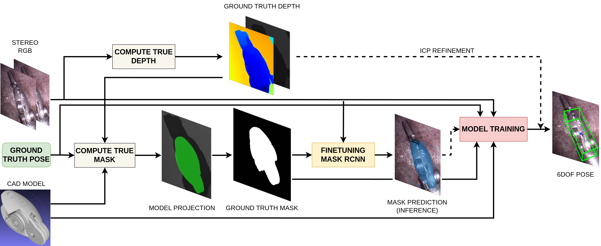

# Seen Method Pipeline

This folder contains two models for object pose estimation: **PVNet** and **GDR-Net**. Each model has its own dataset requirements, training and evaluation scripts, and post-processing utilities. Follow the instructions below for setting up and running both models.


---

## PVNet

### Dataset Setup

PVNet requires a specific dataset structure that closely resembles the BOP format but has some differences:

```
├──data/custom/
│   ├── model.ply
│   ├── camera.txt
│   ├── diameter.txt  # Object diameter in meters
│   ├── rgb/
│   │   ├── 0.jpg
│   │   ├── 1.jpg
│   │   └── ... 
│   ├── mask/
│   │   ├── 0.png
│   │   └── ...
│   ├── pose/
│   │   ├── pose0.npy
│   │   └── ...
```

### Running PVNet

1. **File Renaming**:
   If your dataset files don't start from 1 or have inconsistent naming, use the `eval_file_transfer.py` script to rename them:

   ```bash
   python Seen_Pipeline/pvnet_lnd/eval_file_transfer.py
   ```

2. **Resizing Images**:
   Ensure the images are resized to `640x480`. Use the script below to resize the dataset:

   ```bash
   python Seen_Pipeline/pvnet_lnd/lib/utils/lnd/resize_custom.py
   ```

3. **Adjusting Intrinsics**:
   Since the images are resized, adjust the camera intrinsics accordingly using:

   ```bash
   python Seen_Pipeline/pvnet_lnd/lib/utils/lnd/modify_intrinsic_resize.py
   ```
4. **Preparing the Dataset**:
   Place the dataset in `data/custom/` and run the following command to prepare the metadata:

   ```bash
   python run.py --type custom
   ```
### Environment Setup

To set up the required environment for PVNet, use the provided `environment.yml` or `requirements.txt` file. Make sure **CUDA 11.3** is installed for stable performance.

After setting up the environment, install the required extensions:

```bash
ROOT=/path/to/pvnet_lnd
cd $ROOT/lib/csrc
export CUDA_HOME="/usr/local/cuda-9.0"
cd ransac_voting && python setup.py build_ext --inplace
cd ../nn && python setup.py build_ext --inplace
cd ../fps && python setup.py build_ext --inplace

# For running PVNet with a detector
cd ../dcn_v2 && python setup.py build_ext --inplace

# For uncertainty-driven PnP
cd ../uncertainty_pnp
sudo apt-get install libgoogle-glog-dev libsuitesparse-dev libatlas-base-dev
python setup.py build_ext --inplace
```

### Training

To train PVNet, use the following command:

```bash
python train_net.py --cfg_file configs/custom.yaml train.batch_size 16
```

### Testing

For testing the model:

```bash
python run.py --type evaluate --cfg_file configs/custom.yaml
```

The output pose (4x4 pose matrix) will be saved to the folder specified at line 100 in `Seen_Pipeline/pvnet_lnd/lib/evaluators/custom/pvnet.py`.

### Visualization

- **Bounding Box Visualization**:
  To visualize colored bounding boxes of the predictions:

  ```bash
  python Seen_Pipeline/pvnet_lnd/pose_inspect_color_bb_pvnet.py
  ```

- **3D Pose Error Visualization**:
  To visualize the 3D model pose transformation using the predicted and ground truth pose:

  ```bash
  python Seen_Pipeline/pvnet_lnd/inspect_pose_pvnet.py
  ```

- **TensorBoard Plotting**:
  To plot training results from TensorBoard logs:

  ```bash
  python Seen_Pipeline/pvnet_lnd/plot_tensorboard.py
  ```

---

## GDR-Net

### Dataset Setup

GDR-Net requires the dataset in BOP format:

```
datasets/
├── BOP_DATASETS  
│   └── lnd
└── VOCdevkit
```

Refer to the **Dataset_Generation_Preparation** folder for instructions on how to create datasets in this format.

### Environment Setup

1. Set up the Conda environment using `environment.yml` or `Seen_Pipeline/gdrnpp_bop2022/requirements/requirements.txt` or `Seen_Pipeline/gdrnpp_bop2022/requirements/full_reference_requirements.txt`.
2. Make sure **CUDA 11.6** is installed for optimal performance.
3. Install **Detectron2** from source:

   ```bash
   sh scripts/install_deps.sh
   ```

4. Compile the necessary C++ extensions for:
   - **Farthest Point Sampling (FPS)**
   - **Flow**
   - **Uncertainty PnP**
   - **RANSAC Voting**
   - **Chamfer Distance**
   - **EGL Renderer**

   To compile all of them, run:

   ```bash
   sh ./scripts/compile_all.sh
   ```

### Training

Train the GDR-Net model using the following command:

```bash
./core/gdrn_modeling/train_gdrn.sh <config_path> <gpu_ids>
```

Example:

```bash
./core/gdrn_modeling/train_gdrn.sh configs/gdrn/lnd/convnext_a6_AugCosyAAEGray_BG05_mlL1_DMask_amodalClipBox_classAware_lnd.py 0
```

### Testing

For testing the trained model:

```bash
./core/gdrn_modeling/test_gdrn.sh <config_path> <gpu_ids> <ckpt_path>
```

Example:

```bash
./core/gdrn_modeling/test_gdrn.sh configs/gdrn/lnd/convnext_a6_AugCosyAAEGray_BG05_mlL1_DMask_amodalClipBox_classAware_lnd.py 0 gdrnpp_bop2022/output/gdrn/lnd/convnext_a6_AugCosyAAEGray_BG05_mlL1_DMask_amodalClipBox_classAware_lnd/model_final.pth
```

### Visualization

- **Bounding Box Visualization**:
  To visualize the bounding box for a single prediction:

  ```bash
  python Seen_Pipeline/gdrnpp_bop2022/pose_inspect_color_bb.py
  ```

- **TensorBoard Plotting**:
  To plot training results from TensorBoard logs:

  ```bash
  python Seen_Pipeline/gdrnpp_bop2022/plot_tensorboard.py
  ```

---

### Conclusion

This README provides detailed instructions for setting up, training, testing, and visualizing results for both **PVNet** and **GDR-Net** models in the Seen Method Pipeline. Make sure to follow the environment setup steps and compile necessary extensions for a smooth execution of the pipeline.