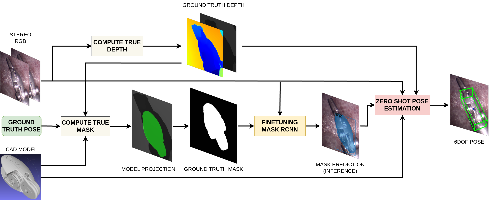

# Unseen Method Pipeline

This folder contains implementations for four different unseen object pose estimation methods: **FoundationPose**, **SAM-6D**, **OVE6D**, and **Megapose**. Each method requires specific input formats and dataset structures, including 3D CAD models, RGB images, depth images, and masks. Below are the detailed instructions for each method.


---

## Data Requirements

All methods require:
- **3D CAD Model**: Supported formats include `.ply`, `.stl`, or `.obj`.
- **RGB Image**: Typically from a stereo camera's left image.
- **Depth Image**: Should correspond to the RGB image, with measurements in millimeters.
- **Mask**: Binary mask, with variations in format (some models use binary masks, others use RLE format).

---

## FoundationPose

### Environment Setup
1. Install the required dependencies using `environment.yml` or `requirements.txt`. This version is tested on **CUDA 11.8**.
2. It is recommended to also check the official installation guide for compatibility.

### Dataset Structure
Organize the dataset as follows:

```
demo_data/test/
├── cam_K.txt
├── depth
│   └── 000114.png
├── masks
│   └── 000114.png
├── rgb
│   └── 000114.png
└── tool.stl
```

### Running FoundationPose
1. Update `Unseen_Pipeline/FoundationPose/run_demo.py` at lines 18 and 19 to specify:
   - Model path
   - Test directory
2. Run the script:

   ```bash
   python Unseen_Pipeline/FoundationPose/run_demo.py
   ```

The output will be stored in the `debug` folder.

---

## SAM-6D

### Installation
1. Set up the environment using `environment.yml` or `requirements.txt` and follow the official installation guide.

### Using Mask R-CNN for Mask Generation
1. Convert binary masks from Mask R-CNN to RLE format using:

   ```bash
   python Unseen_Pipeline/SAM-6D/SAM-6D/mask2RLE.py
   ```

### Running Inference
1. Modify lines 8-14 in `Unseen_Pipeline/SAM-6D/SAM-6D/demo.py` to reflect the correct input directories:
   
   ```python
   cad_path = "/path/to/cad_model.ply"
   rgb_dir = "/path/to/rgb"
   depth_dir = "/path/to/depth"
   camera_path = "/path/to/camera.json"
   output_dir = "/path/to/output"
   final_output_dir = "/path/to/final_output"
   segmentation_dir = "/path/to/rle_jsons"
   ```

2. The `camera.json` file should be structured as follows:

   ```json
   {"cam_K": [fx, 0, cx, 0, fy, cy, 0, 0, 1], "depth_scale": 1.0}
   ```

3. Run the inference:

   ```bash
   python Unseen_Pipeline/SAM-6D/SAM-6D/demo.py
   ```

### SAM-6D with SAM (Segment Anything Model)

To run SAM-6D with SAM (skipping the mask-to-RLE step):

1. Modify lines 7-12 in `Unseen_Pipeline/SAM-6D/SAM-6D/demo_with_sam.py` to specify input directories:

   ```python
   cad_path = "/path/to/cad_model.ply"
   rgb_dir = "/path/to/rgb"
   depth_dir = "/path/to/depth"
   camera_path = "/path/to/camera.json"
   output_dir = "/path/to/output"
   final_output_dir = "/path/to/final_output_sam"
   ```

2. Run the inference:

   ```bash
   python Unseen_Pipeline/SAM-6D/SAM-6D/demo_with_sam.py
   ```

---

## OVE6D

### Installation
1. Set up the environment using `environment.yml` or `requirements.txt`, and refer to the official installation guide.
2. This method is tested on **CUDA 11.8**.

### Running OVE6D
1. Use the Jupyter notebook at `Unseen_Pipeline/OVE6D-pose/example/lnd.ipynb`.
2. Define paths to:
   - Finetuned Mask R-CNN model
   - Dataset path (containing RGB, depth, and visible masks)
   - BOP format files (`scene_camera.json`, `scene_gt.json`, etc.)
3. The notebook integrates Mask R-CNN for mask generation and runs inference, providing visualizations of the predicted pose.

---

## Megapose

### Installation
1. Install dependencies using `environment.yml` or `requirements.txt`, and follow the official installation guide.

### Running Megapose
1. Populate the directory `Unseen_Pipeline/megapose6d/local_data/examples/lnd1` with:
   - RGB images
   - Depth images
   - Masks (`mask_visib`)
   - Camera data (`camera_data.json`)
   - Mesh files

2. The `camera_data.json` file should be in the following format:

   ```json
   {"K": [[801.57991404, 0.0, 583.56089783], [0.0, 801.57991404, 309.78999329], [0.0, 0.0, 1.0]], "resolution": [540, 960]}
   ```

3. To run the inference script:

   ```bash
   python -m megapose.scripts.run_inf_all lnd1 --run-inference --model megapose-1.0-RGB-multi-hypothesis-icp
   ```

4. Visualizations will be saved in the directory specified at line 322 of the script (`prediction_output_dir`).

---

### Conclusion

This README outlines the setup and usage of the unseen object pose estimation methods: **FoundationPose**, **SAM-6D**, **OVE6D**, and **Megapose**. Ensure that the input datasets are correctly formatted, and refer to the specific installation and running instructions for each method to obtain the best results.